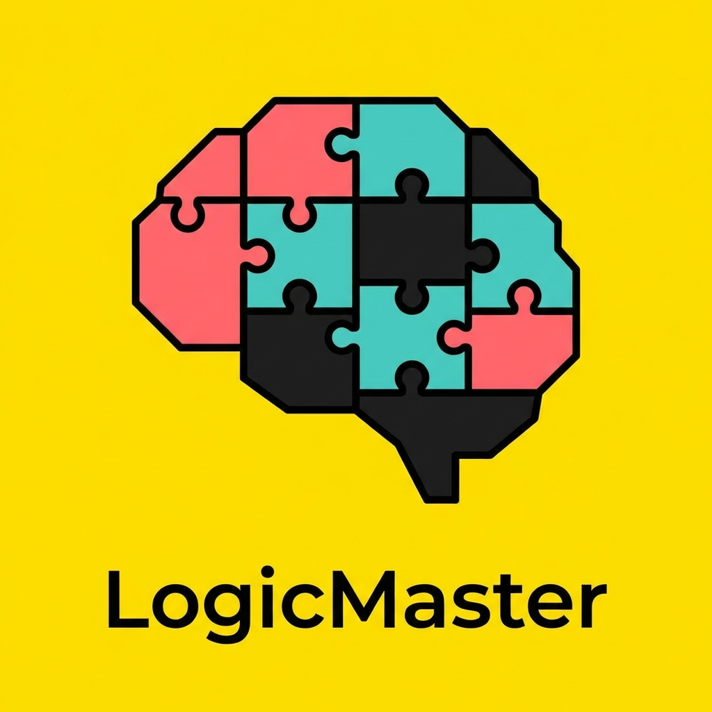

# LogicMaster

LogicMaster is a modern, interactive web application designed to challenge and sharpen your mind with the world's most famous logic puzzles. Built with React and Tailwind CSS, it offers a clean, distraction-free environment to solve riddles, math problems, and lateral thinking challenges.



## Features

*   **Curated Collection**: Over 50 classic and modern puzzles including "The Monty Hall Problem", "Einstein's Riddle", "100 Prisoners", and more.
*   **Difficulty Levels**: Filter puzzles by **Easy**, **Medium**, and **Hard** to find the right challenge for you.
*   **Progress Tracking**: Automatically saves your solved puzzles so you can track your journey to becoming a logic master.
*   **Zero Distractions**: No ads, no timers, no multiple-choice guessing. Just you and the problem.
*   **Responsive Design**: A beautiful "Neo-Brutalist" aesthetic that works perfectly on desktop and mobile.
*   **Reveal Solutions**: Stuck? Reveal detailed step-by-step solutions to understand the logic behind the answer.

## Tech Stack

*   **Frontend Library**: [React 19](https://react.dev/)
*   **Build Tool**: [Vite](https://vitejs.dev/)
*   **Styling**: [Tailwind CSS v4](https://tailwindcss.com/)
*   **Routing**: [React Router v7](https://reactrouter.com/)
*   **Icons**: [Lucide React](https://lucide.dev/)
*   **Utilities**: `clsx`, `tailwind-merge`

## Getting Started

Follow these steps to run the project locally on your machine.

### Prerequisites

*   Node.js (v18 or higher recommended)
*   npm or yarn

### Installation

1.  **Clone the repository**
    ```bash
    git clone https://github.com/yourusername/LogicMaster.git
    cd LogicMaster
    ```

2.  **Install dependencies**
    ```bash
    npm install
    ```

3.  **Start the development server**
    ```bash
    npm run dev
    ```

4.  **Open in Browser**
    Visit `http://localhost:5173` to start solving!

## Contributing

Contributions are welcome! If you have a favorite riddle or puzzle that isn't included:

1.  Fork the project.
2.  Create your feature branch (`git checkout -b feature/AmazingPuzzle`).
3.  Add your puzzle to `src/data/puzzles.json`.
4.  Commit your changes (`git commit -m 'Add Amazing Puzzle'`).
5.  Push to the branch (`git push origin feature/AmazingPuzzle`).
6.  Open a Pull Request.

## License

This project is open source and available under the [MIT License](LICENSE).

---

*Built with brainpower.*
